## Demonstration

### `/koi-ping`

Replies with `Pong!`.

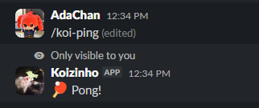

### `/koi-apod`

Shows NASA's Astronomy Picture of the Day.

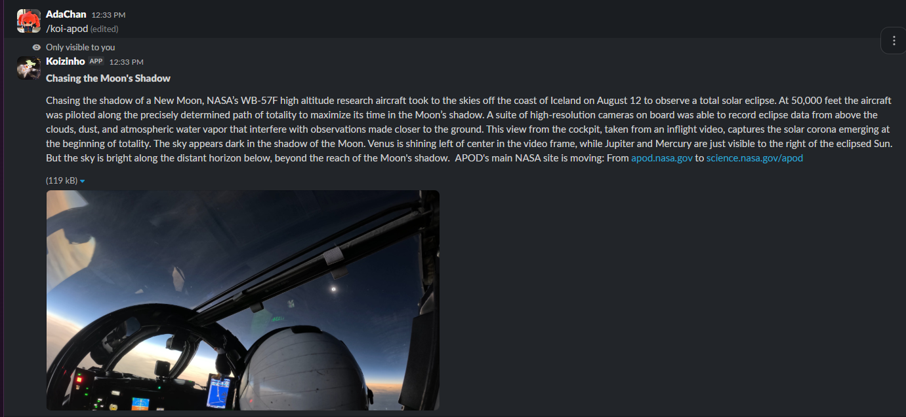

### `/koi-cat`

Displays a random cat image.

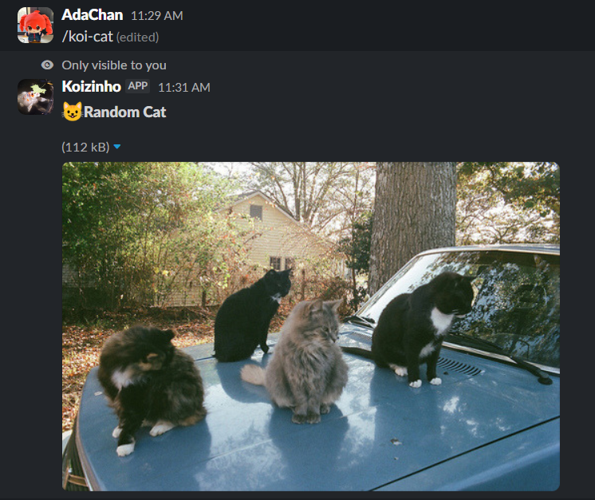

### `/koi-dog`

Displays a random dog image.

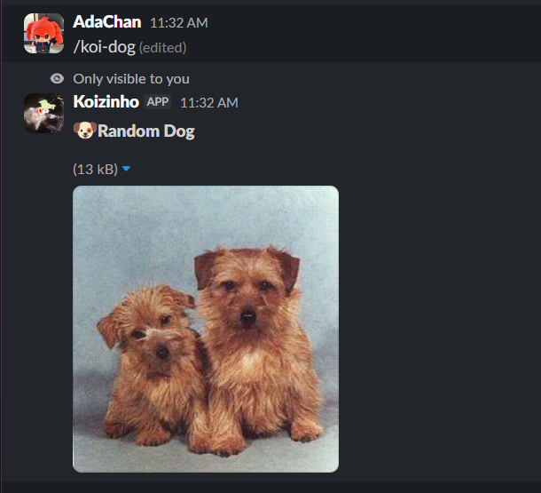

### `/koi-fox`

Displays a random fox image.

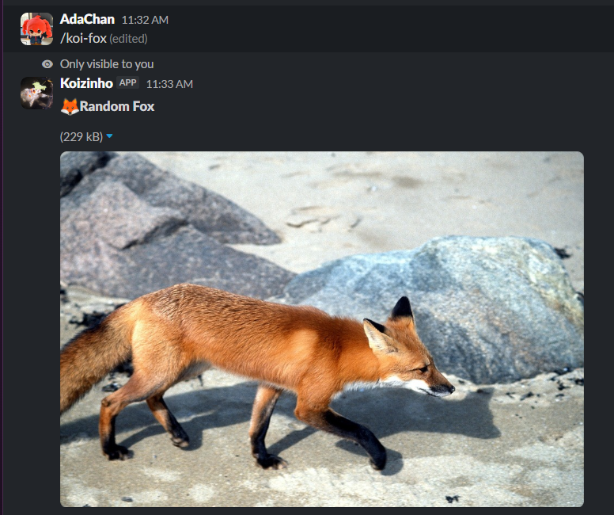

### `/koi-duck`

Displays a random duck image.

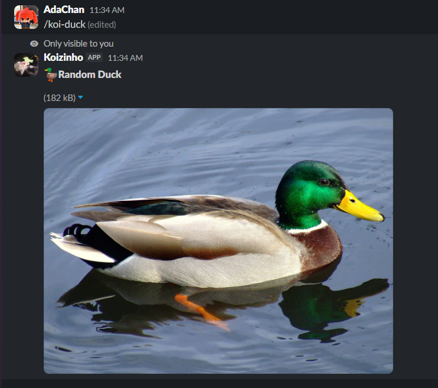

### `/koi-say`

Repeats the text you send.

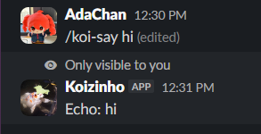

### `/koi-sound`

Lets you choose an animal and plays its sound.

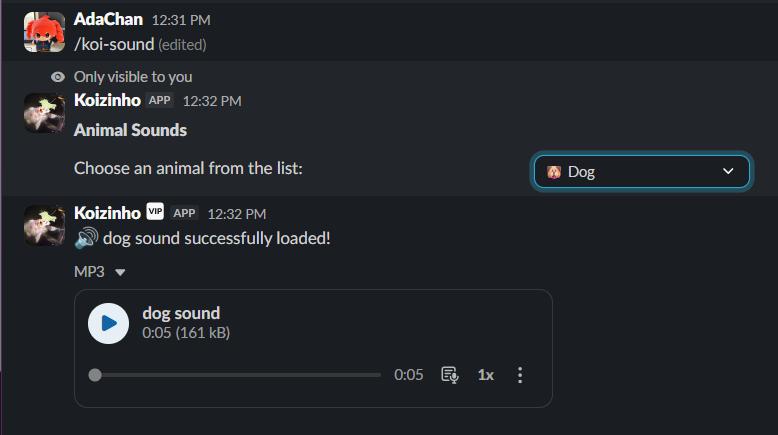

### `/koi-tts`

Converts your text into speech and sends it as an MP3 file.

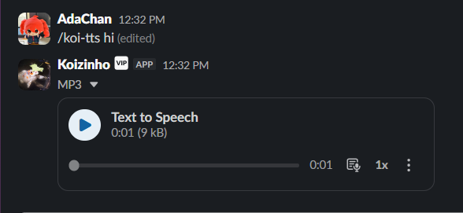

### `/koi-calc`

Solves a mathematical expression.

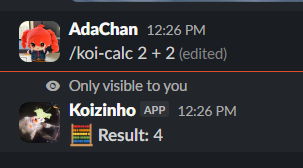

### `/koi-rps`

Rock Paper Scissors game.

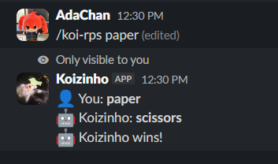

### `/koi-8ball`

Ask a question and let luck decide your answer.

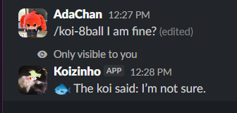

### `/koi-coin`

Heads or tails.

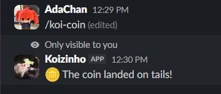

### `/koi-help`

Lists all available Koi commands.

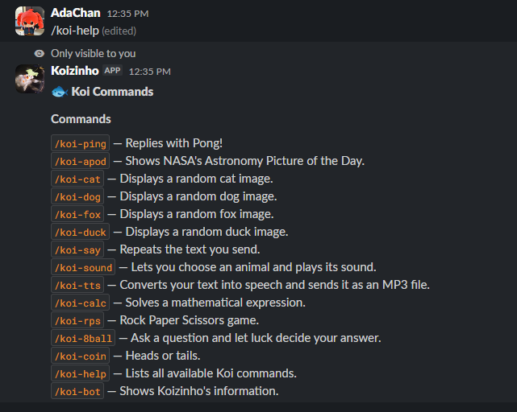

### `/koi-bot`

Shows Koizinho's information.

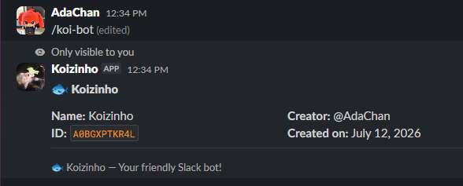

### `/koi-user`

View detailed information about a Slack user.

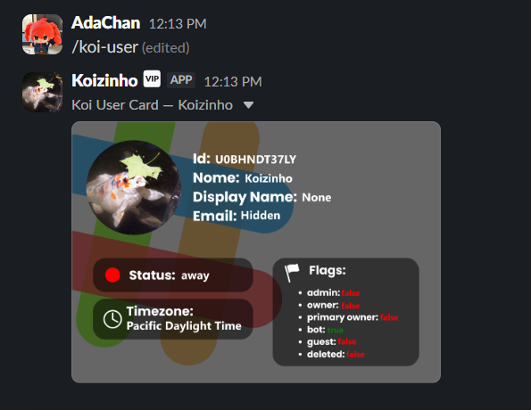